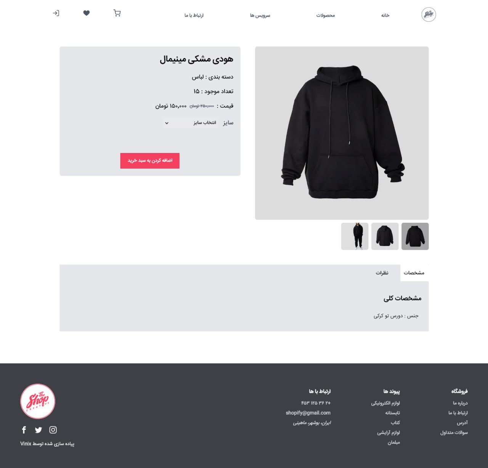

# 🛍️ Shopify Clone - Storefront

Storefront of the Shopify Clone project! This application is built with Next.js for a fast, server-rendered shopping experience.

*This storefront fetches data from [Backend](https://github.com/vinixdev/shopify_backend) and is managed via the [Admin Panel](https://github.com/vinixdev/shopify-admin-panel).*

---

### ✨ Features

* **Server-Side Rendering (SSR)**: Fast initial page loads and great SEO.
* **Static Site Generation (SSG)**: Product pages are pre-rendered for instant loading.
* **Full Shopping Cart**: Add, remove, and update products in the cart.
* **Customer Authentication**: Users can sign up, log in, and view their order history.
* **Modern & Responsive UI**: A clean, modern design that looks great on any device.
---

### 🛠️ Tech Stack

* **Framework**: Next.js
* **Styling**: Tailwind CSS

---

### 🚀 Getting Started

Follow these instructions to get the Next.js storefront running on your local machine.

**Prerequisites**

* Node.js (v18.x or later)
* npm or yarn
* A running instance of the [backend server](https://github.com/vinixdev/shopify_backend).

**Installation & Setup**

1.  **Clone the repository:**
    ```sh
    git clone [https://github.com/vinixdev/shopify_frontend_next.git](https://github.com/vinixdev/shopify_frontend_next.git)
    cd shopify_frontend_next
    ```

2.  **Install dependencies:**
    ```sh
    npm install
    ```

3.  **Run the development server:**
    ```sh
    npm run dev
    ```
    The storefront will be available at `http://localhost:3001`.

---

### 💻️ Screenshots and Demo

* **Demo**:
    
* **Product list**:
    
* **Product page**:
    

---

### 🔗 Related Repositories

* **Backend**: [github.com/vinixdev/shopify_backend](https://github.com/vinixdev/shopify_backend)
* **Admin Panel**: [github.com/vinixdev/shopify-admin-panel](https://github.com/vinixdev/shopify-admin-panel)

